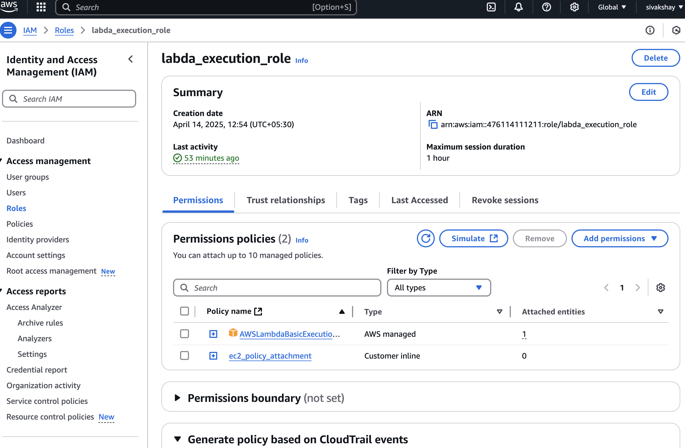
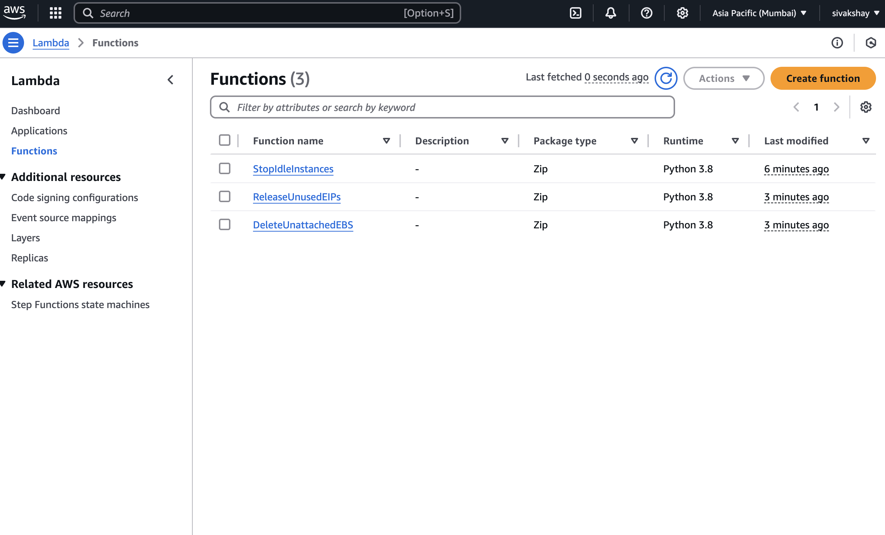
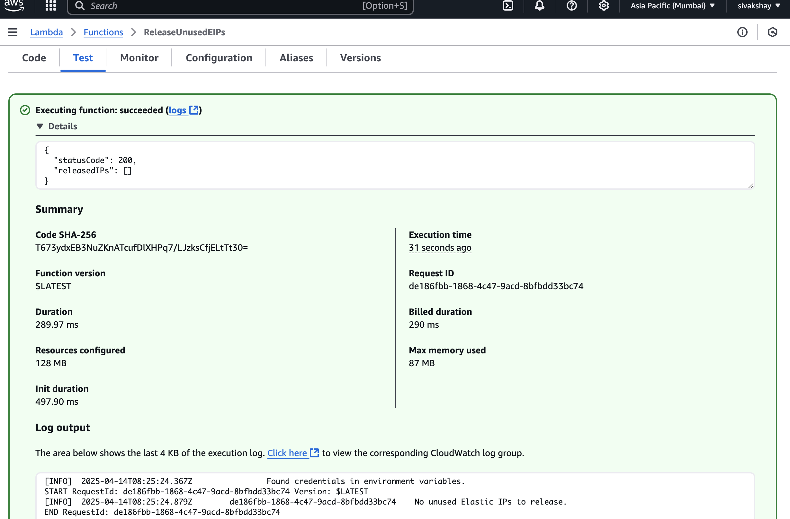
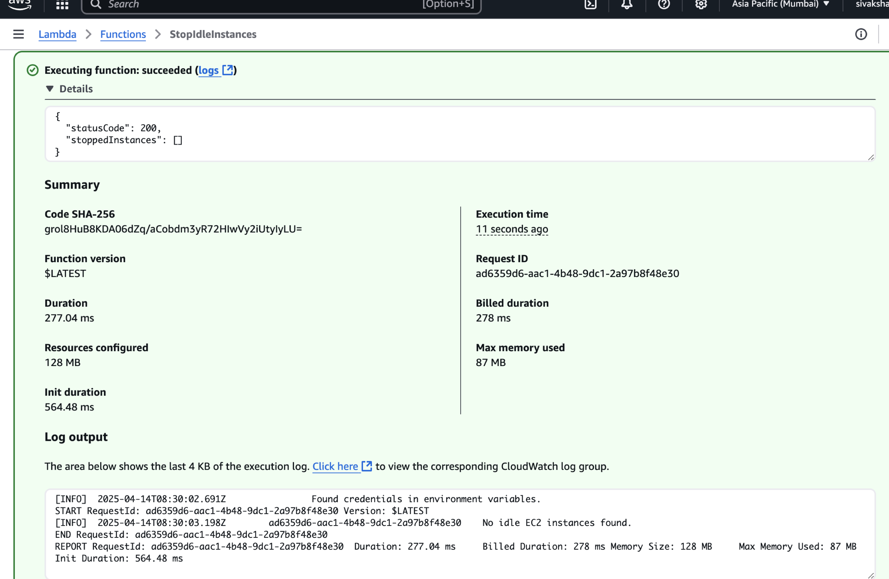

# AWS Cost Optimizer Demo

## Description
This project demonstrates a fully automated solution for optimizing AWS costs using Lambda functions, CloudWatch Events, and Terraform. The solution helps you:

- Automatically stop idle EC2 instances.
- Delete unused EBS volumes.
- Release unused Elastic IPs (EIPs).

This project is built using Terraform for infrastructure provisioning, and Python Lambda functions for automation.

## Features
- **Stop Idle EC2 Instances**: Identifies and stops EC2 instances that have been running for more than 24 hours
- **Delete Unattached EBS Volumes**: Deletes EBS volumes that are not attached to any EC2 instance.
- **Release Unused Elastic IPs**: Identifies and releases unused Elastic IPs.

## Infrastructure Architecture
- **Terraform**: Used to provision the required AWS resources.
- **AWS Lambda**: Serverless functions to perform cost-saving tasks.
- **IAM Roles**: Grant necessary permissions to Lambda functions to interact with EC2, EBS, and Elastic IPs.

## Prerequisites
1. **Terraform**: You must have Terraform installed and configured to interact with AWS. If not installed, follow the official Terraform [installation guide](https://www.terraform.io/docs/cli/install.html).
2. **AWS CLI**: Ensure AWS CLI is installed and configured with appropriate permissions. If not, follow the AWS CLI [installation guide](https://docs.aws.amazon.com/cli/latest/userguide/cli-configure-quickstart.html).
3. **AWS Account**: You will need access to an AWS account with the required permissions to create resources.

## Setup and Installation

### 1. Clone the repository
```bash
git clone https://github.com/your-username/aws-cost-optimizer-demo.git
```

### 2. Terraform Configuration

- Initialize Terraform:
  ```bash
  terraform init
  ```
- Review the Terraform configuration and preview the changes:
    ```bash
    terraform plan
    ```

- Apply the Terraform configuration to provision resources:
  ```bash
  terraform apply
  ```

  **Note**: Terraform will prompt you to confirm the changes before applying. Type `yes` to proceed.


### 3. Verify Changes in Console

After applying the Terraform configuration, log in to the AWS Management Console to verify that the resources have been created successfully:





We can also select the function and run a manuall test





### 4. Lambda Functions
The Lambda functions responsible for stopping idle EC2 instances, deleting unattached EBS volumes, and releasing unused Elastic IPs are located in the `lambda` directory.

Each Lambda function is packaged as a `.zip` file and referenced in Terraform:

- **stop-idle-instances.zip**: Stops idle EC2 instances.
- **delete-unattached-ebs.zip**: Deletes unattached EBS volumes.
- **release-unused-eip.zip**: Releases unused Elastic IPs.

### 4. IAM Roles and Policies
- IAM roles with necessary permissions are automatically created by Terraform.
- Ensure that the Lambda functions are assigned appropriate IAM roles for EC2, EBS, and Elastic IP operations.

### 5. Use CloudWatch Events
You can use CloudWatch Events scheduled to trigger the Lambda functions periodically (e.g., daily)

## Lambda Function Code

- **stop-idle-instances.py**: This function checks the CPU usage of EC2 instances and stops those that are idle.
- **delete-unattached-ebs.py**: This function identifies unattached EBS volumes and deletes them.
- **release-unused-eip.py**: This function identifies unused Elastic IPs and releases them.

You can modify the code in these Python files to meet your specific requirements, such as adjusting thresholds for idle EC2 instances.


## Clean Up
To delete the resources created by this project, run the following command:
```bash
terraform destroy
```

This will remove all the resources that were provisioned by Terraform.

## Conclusion
This demo provides an efficient way to optimize AWS costs by automating key operations like stopping idle EC2 instances, deleting unused EBS volumes, and releasing unused Elastic IPs. You can easily extend this project to include additional cost-saving actions and tailor it to your specific requirements.
